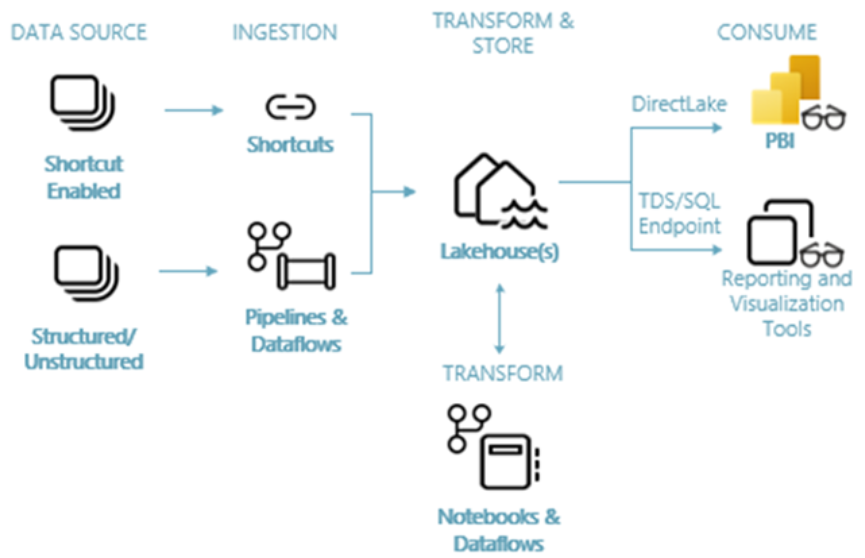

# 🏗️ Projet d’Intégration et d’Analyse de Données avec Microsoft Fabric

Ce dépôt contient tous les éléments d'un projet d'intégration de données (fichiers Excel, données stockées sur Azure Blob, etc.) au sein de **Microsoft Fabric**, incluant :
- L'ingestion
- La préparation
- Le traitement
- Et la visualisation des données

## 🔁 Architecture Globale

---

## 🧱 BRONZE – Ingestion des Données

**Objectif** : Collecter et centraliser les données brutes dans un environnement unifié.

- Utilisation de **dataflows** et **pipelines** pour charger les données dans un **Lakehouse** Fabric.
- Compatible avec données **structurées** (CSV, Excel, SQL) et **non structurées** (JSON, logs...).

---

## 🧪 SILVER – Transformation et Structuration

**Objectif** : Nettoyer, transformer et structurer les données.

- Utilisation de **notebooks PySpark SQL** pour :
  - Créer les tables de **dimensions** et de **faits**
  - Appliquer des règles de gestion
  - Réaliser des agrégations intermédiaires

---

## 🏆 GOLD – Restitution et Visualisation

**Objectif** : Proposer une couche analytique prête à l’usage.

- Utilisation des **semantic models Power BI auto-générés**
- Rapport `Auto-create` généré automatiquement à partir des modèles
- Rapport `Profit Reporting` personnalisé pour l’analyse des indicateurs clés
